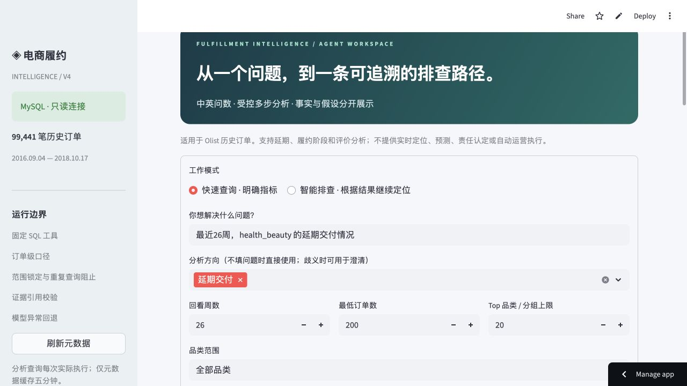
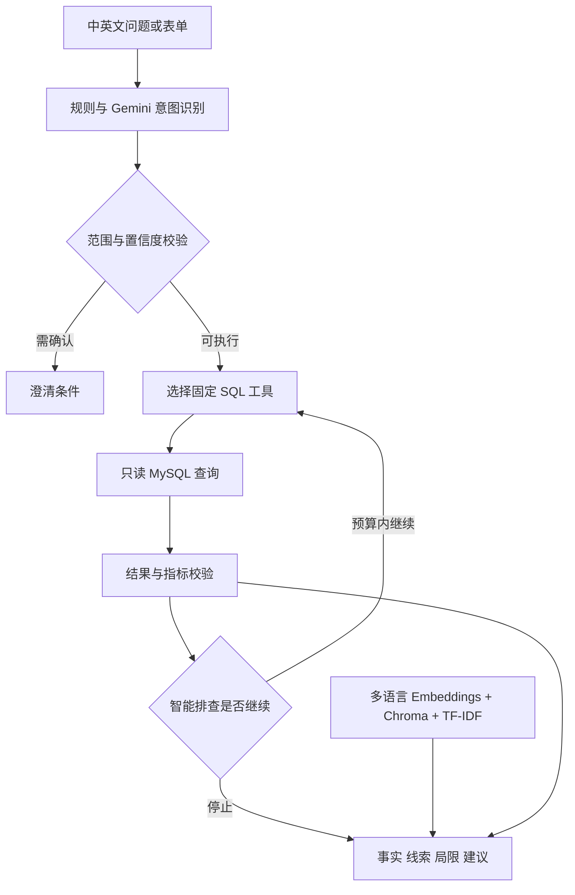

<div align="center">

# Fulfillment Intelligence · 电商履约分析

**从一个业务问题，到可追溯的 SQL 事实与排查路径。**

[体验线上新版](https://ecommerce-fulfillment-agent.streamlit.app/) · [版本与验证记录](PROJECT_NOTES.md) · [运行公开原型](#运行公开原型)

`Python` · `Streamlit` · `MySQL` · `Gemini` · `Chroma`

**99,441 笔历史订单 · 延期 / 履约阶段 / 评价 · 只读分析**

</div>



> **版本说明：本仓库保存公开原型代码；在线演示运行的是独立私有仓库中的新版。** 下文“新版”能力、截图与验证结果不代表本仓库原型代码已全部实现。免费云服务可能休眠或冷启动。

## 业务问题

延期交付、履约节点与客户评价分散在多张业务表中。运营人员需要先确定指标口径，再关联订单、商品、卖家和评价，才能定位问题集中在哪些品类、州际组合或时间段。本项目让用户通过自然语言发起分析，并保留 SQL、样本范围与证据供复核。

## 线上新版能做什么

| 模式 | 场景 | 行为 |
|---|---|---|
| 快速查询 | “最近26周，health_beauty 的延期交付情况” | 对明确意图执行相应 SQL，生成事实与摘要 |
| 智能排查 | 从某品类的异常继续定位区域、卖家或周趋势 | 在查询次数及时间预算内，根据证据选择下一步工具 |

两种模式均可启用或关闭 Gemini。开启时可能用于需求理解、下一步选择及结果解释；关闭或服务失败时走受控规则路径，无法确定的条件先澄清。页面显示实际模型请求数。

## 新版分析链路



模型从受限工具集合中选择动作，SQL 工具负责事实计算；这不是任意生成 SQL 并直接执行的开放式系统。知识检索提供业务口径与解释参考，不能替代数据库事实。

## 数据与指标

使用 **Olist 巴西电商历史订单数据**，部署库包含 9 张基础表：orders、order_items、order_payments、order_reviews、customers、sellers、products、geolocation、product_category_name_translation。

- 数据库订单数：99,441；时间跨度为 2016—2018 年。
- “最近 N 周”以数据库最新下单时间为锚点，不以今天为锚点。
- 新版按订单级口径计算；延期分母使用满足送达与预计送达字段要求的有效订单。
- 评价覆盖率、有效样本与缺失情况需要和比例一起解释。

## 一个实际运行案例

2026-10-07 云端查询：`最近26周，health_beauty 的延期交付情况`，关闭 Gemini。

| 结果 | 数值 |
|---|---:|
| 订单数 / 延期有效分母 | 3,200 |
| 延期订单数 | 258 |
| 延期率 | 8.06% |
| 延期订单平均延期天数 | 约 6.07 天 |
| SQL 成功数 | 1 / 1 |
| 实际模型请求数 | 0 |

该案例验证真实数据库查询与报告展示，不是模型准确率或业务收益证明。

## 原型与新版的关系

| 方面 | 本仓库公开原型 | 线上私有新版 |
|---|---|---|
| 代码组织 | app.py 为主要入口 | 按路由、工具、Agent、报告、检索拆分 |
| 知识检索 | LangChain / Chroma / 本地嵌入依赖 | 多语言嵌入 + Chroma + TF-IDF 融合及回退 |
| 执行方式 | 自然语言映射到预设分析流程 | 快速查询与受控多步排查 |
| 约束与追溯 | 原型内的规则及展示 | 范围锁定、查询预算、重复阻止、证据引用校验 |
| 部署 | 需要自行配置环境和 MySQL | Streamlit Cloud + Aiven MySQL |

## 验证状态

新版本地回归测试 38 项通过；云端真实 SQL 与 hybrid 检索已验证。22 条合成检索题中，hybrid 在 18 条相关题的 Hit@3 为 18/18，但 Top1 与无关问题拒绝率并非全面优于其他方法。完整表格见 [验证记录](PROJECT_NOTES.md)。Gemini 完整真实模型评估仍待可用额度，不能视为已完成。

## 运行公开原型

此步骤运行仓库里的原型，**不会复现线上新版的全部功能**。原型不是独立的一键数据包，需自行准备兼容的 Olist MySQL 表及 SQL 使用的视图。

```bash
python -m venv .venv
source .venv/bin/activate
pip install -r requirements.txt
cp .env.example .env
streamlit run app.py
```

填写自己的只读数据库连接与可选 Gemini 配置。示例配置将知识文件路径指向本仓库根目录的 policy.md 与 ops_kb.md。新补充的依赖列表依据原型导入项整理，未在全新环境完整安装验证；不得将其解释为已锁定的生产依赖。

## 能力边界

适用于历史订单的描述性分析与运营排查；不提供实时物流定位、预测、责任认定或自动运营执行。相关性不等于因果，模型假设需要人工复核。免费资源下可能出现查询延迟或超时。

## English overview

An e-commerce fulfillment analysis project using historical Olist orders. This public repository contains the original prototype; the live demo runs a newer private implementation with bounded multi-step investigation, read-only SQL tools, evidence validation and hybrid knowledge retrieval. Evaluation results are version-specific and do not imply causal conclusions or measured business impact.
